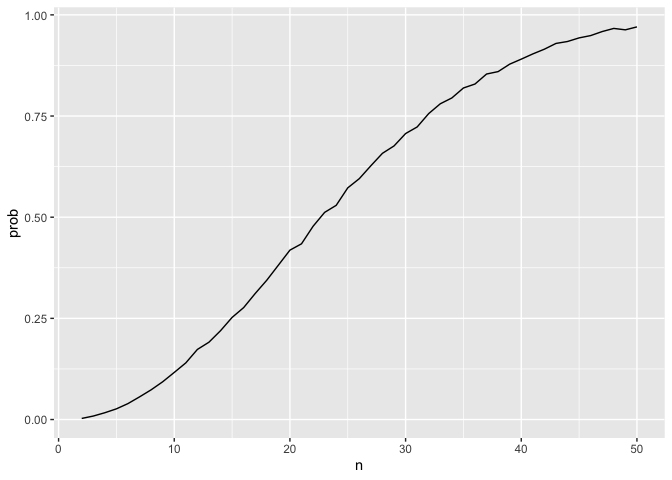
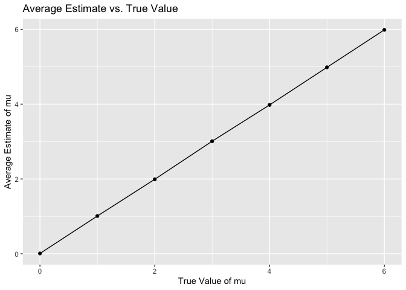
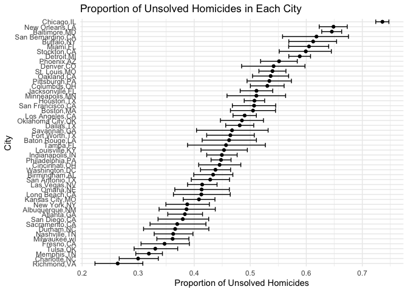

p8105_hw5_SL5454
================
Sining Leng
2024-11-07

## Problem 1

``` r
bday = function(n) {

  bdays = sample(1:365, size = n, replace = TRUE)
  
  duplicate = length(unique(bdays)) < n

  return(duplicate)
  
}

bday_samp = 
  expand_grid(
    n = 2:50,
    iter = 1:10000
  ) |> 
  mutate(res = map_lgl(n, bday)) |> 
  group_by(n) |> 
  summarize(prob = mean(res))

bday_samp |>
  ggplot(aes(x = n, y = prob)) + 
  geom_line()
```

<!-- -->

The probability that at least two people in the group will share a
birthday increasing with group size. Around group size of 23, the
probability exceeds 50%.

## Problem 2

``` r
t_test = function(n = 30, sigma = 5, mu) {
  
  data = rnorm(n, mean = mu, sd = sigma)
  
  ttest_result = t.test(data, mu = 0, conf.level = 0.95) |>
    broom::tidy()
  
  return(ttest_result)
}

set.seed(123)
mu_df = 
  expand_grid(
    mu = 0:6,
    iter = 1:5000
  ) |>
  mutate(output = map(mu, ~t_test(mu = .x))) |>
  unnest(output)
```

Repeat mu = 0:6

``` r
rejected =
  mu_df |>
  group_by(mu) |>
  summarize(
    power = mean(p.value < 0.05),
    avg_est = mean(estimate),
    avg_reject = mean(estimate[p.value < 0.05])
  )
```

### Plot 2.1

``` r
rejected |>
  ggplot(aes(x = mu, y = power)) +
  geom_line() +
  labs(title = "Power of t-test vs. True Value of mu",
       x = "mu",
       y = "Power") +
  theme_minimal()
```

<!-- -->

The plot shows that the greater the effective size the larger the power
of this t test.

### Plot 2.2

``` r
rejected |>
  ggplot(aes(x = mu, y = avg_est)) +
  geom_point() +
  geom_line() + 
  labs(title = "Average Estimate vs. True Value",
       x = "True Value of mu",
       y = "Average Estimate of mu")
```

<!-- -->

``` r
rejected |>
  ggplot(aes(x = mu, y = avg_reject)) +
  geom_point() +
  geom_line() +
  labs(title = "Average Estimate in Rejected vs. True Value",
       x = "True Value of mu",
       y = "Average Estimate of mu with Rejected Null")
```

<!-- -->

The estimates for samples where the null was rejected tend to be higher
than the true μ, especially for smaller estimates. Thus, the sample
average of 𝜇̂ across tests for which the null is rejected isn’t
approximately equal to the true value of μ. This is because we are only
looking at a biased subset of data that met the rejection criterion,
which doesn’t reflect the true value.

## Problem 3

``` r
us_homicide = 
  read_csv("./data/homicide-data.csv") |>
  janitor::clean_names()
```

    ## Rows: 52179 Columns: 12
    ## ── Column specification ────────────────────────────────────────────────────────
    ## Delimiter: ","
    ## chr (9): uid, victim_last, victim_first, victim_race, victim_age, victim_sex...
    ## dbl (3): reported_date, lat, lon
    ## 
    ## ℹ Use `spec()` to retrieve the full column specification for this data.
    ## ℹ Specify the column types or set `show_col_types = FALSE` to quiet this message.

There are 12 variables in the raw dataset. It contains status and
location of homicides reported from 2010 to 2016. It also includes
variables that describe basic information of victims, such as name, sex
and age.

``` r
count_homicide =
  us_homicide |>
  mutate(
    state = if_else(city == "Tulsa" & state == "AL", "OK", state),
    city_state = paste(city, state, sep = ",")
  ) |>
  group_by(city_state) |>
  summarize(
    total_homicides = n(),
    unsolved_homicides = sum(disposition %in% c("Closed without arrest", "Open/No arrest"))
  ) |>
  ungroup()

count_homicide
```

    ## # A tibble: 50 × 3
    ##    city_state     total_homicides unsolved_homicides
    ##    <chr>                    <int>              <int>
    ##  1 Albuquerque,NM             378                146
    ##  2 Atlanta,GA                 973                373
    ##  3 Baltimore,MD              2827               1825
    ##  4 Baton Rouge,LA             424                196
    ##  5 Birmingham,AL              800                347
    ##  6 Boston,MA                  614                310
    ##  7 Buffalo,NY                 521                319
    ##  8 Charlotte,NC               687                206
    ##  9 Chicago,IL                5535               4073
    ## 10 Cincinnati,OH              694                309
    ## # ℹ 40 more rows

### Baltimore, MD

``` r
baltimore = 
  count_homicide |>
  filter(city_state == "Baltimore,MD") 

baltimore_prop =
  prop.test(
    x = baltimore$unsolved_homicides,
    n = baltimore$total_homicides
  ) |>
  broom::tidy() 

baltimore_est =
  baltimore_prop|>
  select(estimate, conf.low, conf.high)

baltimore_est
```

    ## # A tibble: 1 × 3
    ##   estimate conf.low conf.high
    ##      <dbl>    <dbl>     <dbl>
    ## 1    0.646    0.628     0.663

### Every city

``` r
city_homicide = 
  count_homicide |>
  mutate(
    test_result = map2(
      unsolved_homicides,
      total_homicides,
      ~ prop.test(x = .x, n = .y)
    )
  ) |>
  mutate(
    test_result = map(test_result, broom::tidy)
  ) |>
  unnest(test_result) |>
  select(city_state, estimate, conf.low, conf.high)

city_homicide
```

    ## # A tibble: 50 × 4
    ##    city_state     estimate conf.low conf.high
    ##    <chr>             <dbl>    <dbl>     <dbl>
    ##  1 Albuquerque,NM    0.386    0.337     0.438
    ##  2 Atlanta,GA        0.383    0.353     0.415
    ##  3 Baltimore,MD      0.646    0.628     0.663
    ##  4 Baton Rouge,LA    0.462    0.414     0.511
    ##  5 Birmingham,AL     0.434    0.399     0.469
    ##  6 Boston,MA         0.505    0.465     0.545
    ##  7 Buffalo,NY        0.612    0.569     0.654
    ##  8 Charlotte,NC      0.300    0.266     0.336
    ##  9 Chicago,IL        0.736    0.724     0.747
    ## 10 Cincinnati,OH     0.445    0.408     0.483
    ## # ℹ 40 more rows

### Plot 3

``` r
city_homicide |>
  mutate(city_state = fct_reorder(city_state, estimate)) |>
  ggplot(aes(x = estimate, y = city_state)) +
  geom_point() +
  geom_errorbar(aes(xmin = conf.low, xmax = conf.high)) +
  labs(
    title = "Proportion of Unsolved Homicides in Each City",
    x = "Proportion of Unsolved Homicides",
    y = "City"
  ) +
  theme_minimal()
```

<!-- -->
