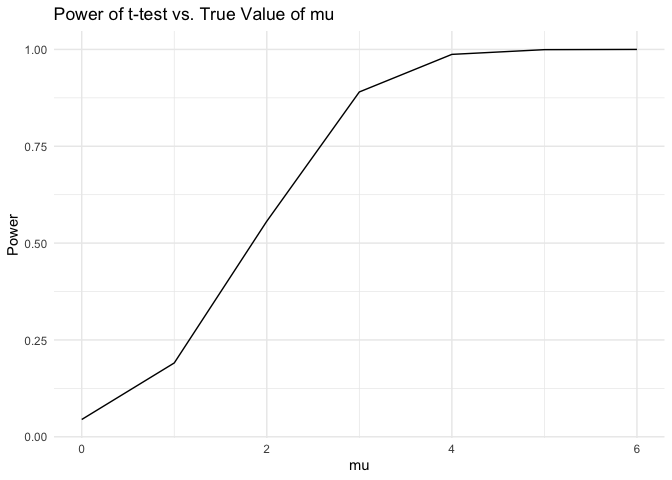

p8105_hw5_SL5454
================
Sining Leng
2024-11-07

## Problem 1

``` r
bday = function(n) {

  bdays = sample(1:365, size = n, replace = TRUE)
  
  duplicate = length(unique(bdays)) < n

  return(duplicate)
  
}

bday_samp = 
  expand_grid(
    n = 2:50,
    iter = 1:10000
  ) |> 
  mutate(res = map_lgl(n, bday)) |> 
  group_by(n) |> 
  summarize(prob = mean(res))

bday_samp |>
  ggplot(aes(x = n, y = prob)) + 
  geom_line()
```

<!-- -->

The probability that at least two people in the group will share a
birthday increasing with group size. Around group size of 23, the
probability exceeds 50%.

## Problem 2

``` r
t_test = function(n = 30, sigma = 5, mu) {
  
  data = rnorm(n, mean = mu, sd = sigma)
  
  ttest_result = t.test(data, mu = 0, conf.level = 0.95) |>
    broom::tidy()
  
  return(ttest_result)
}

set.seed(123)
mu_df = 
  expand_grid(
    mu = 0:6,
    iter = 1:5000
  ) |>
  mutate(output = map(mu, ~t_test(mu = .x))) |>
  unnest(output)
```

Repeat mu = 0:6

``` r
rejected =
  mu_df |>
  group_by(mu) |>
  summarize(
    power = mean(p.value < 0.05),
    avg_est = mean(estimate),
    avg_reject = mean(estimate[p.value < 0.05])
  )
```

### Plot 2.1

``` r
rejected |>
  ggplot(aes(x = mu, y = power)) +
  geom_line() +
  labs(title = "Power of t-test vs. True Value of mu",
       x = "mu",
       y = "Power") +
  theme_minimal()
```

<!-- -->

The plot shows that the greater the effective size the larger the power
of this t test.

### Plot 2.2

``` r
rejected |>
  ggplot(aes(x = mu, y = avg_est)) +
  geom_point() +
  geom_line() + 
  labs(title = "Average Estimate vs. True Value",
       x = "True Value of mu",
       y = "Average Estimate of mu")
```

<!-- -->

``` r
rejected |>
  ggplot(aes(x = mu, y = avg_reject)) +
  geom_point() +
  geom_line() +
  labs(title = "Average Estimate in Rejected vs. True Value",
       x = "True Value of mu",
       y = "Average Estimate of mu with Rejected Null")
```

<!-- -->

The estimates for samples where the null was rejected tend to be higher
than the true μ, especially for smaller effect sizes. Thus, the sample
average of𝜇̂ across tests for which the null is rejected approximately
equal to the true value of μ, but the sample mean 𝜇̂ differs from the
true value μ when μ \< 4.
