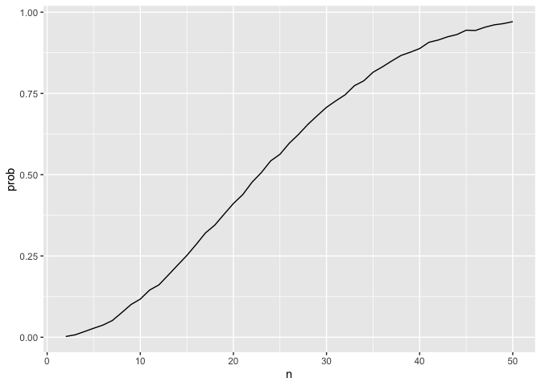
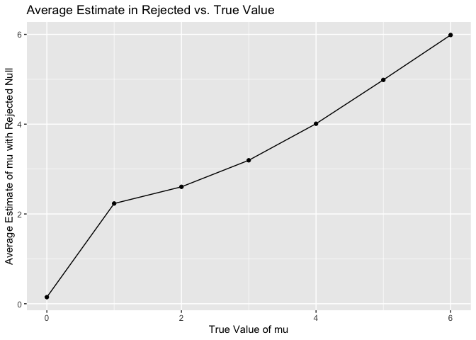

p8105_hw5_SL5454
================
Sining Leng
2024-11-07

## Problem 1

``` r
bday = function(n) {

  bdays = sample(1:365, size = n, replace = TRUE)
  
  duplicate = length(unique(bdays)) < n

  return(duplicate)
  
}

bday_samp = 
  expand_grid(
    n = 2:50,
    iter = 1:10000
  ) |> 
  mutate(res = map_lgl(n, bday)) |> 
  group_by(n) |> 
  summarize(prob = mean(res))

bday_samp |>
  ggplot(aes(x = n, y = prob)) + 
  geom_line()
```

<!-- -->

The probability that at least two people in the group will share a
birthday increasing with group size. Around group size of 23, the
probability exceeds 50%.

## Problem 2

``` r
t_test = function(n = 30, sigma = 5, mu) {
  
  data = rnorm(n, mean = mu, sd = sigma)
  
  ttest_result = t.test(data, mu = 0, conf.level = 0.95) |>
    broom::tidy()
  
  return(ttest_result)
}

set.seed(123)
mu_df = 
  expand_grid(
    mu = 0:6,
    iter = 1:5000
  ) |>
  mutate(output = map(mu, ~t_test(mu = .x))) |>
  unnest(output)
```

Repeat mu = 0:6

``` r
rejected =
  mu_df |>
  group_by(mu) |>
  summarize(
    power = mean(p.value < 0.05),
    avg_est = mean(estimate),
    avg_reject = mean(estimate[p.value < 0.05])
  )
```

### Plot 2.1

``` r
rejected |>
  ggplot(aes(x = mu, y = power)) +
  geom_line() +
  labs(title = "Power of t-test vs. True Value of mu",
       x = "mu",
       y = "Power") +
  theme_minimal()
```

<!-- -->

The plot shows that the greater the effective size the larger the power
of this t test.

### Plot 2.2

``` r
rejected |>
  ggplot(aes(x = mu, y = avg_est)) +
  geom_point() +
  geom_line() + 
  labs(title = "Average Estimate vs. True Value",
       x = "True Value of mu",
       y = "Average Estimate of mu")
```

<!-- -->

``` r
rejected |>
  ggplot(aes(x = mu, y = avg_reject)) +
  geom_point() +
  geom_line() +
  labs(title = "Average Estimate in Rejected vs. True Value",
       x = "True Value of mu",
       y = "Average Estimate of mu with Rejected Null")
```

<!-- -->

The estimates for samples where the null was rejected tend to be higher
than the true μ, especially for smaller effect sizes. Thus, the sample
average of𝜇̂ across tests for which the null is rejected approximately
equal to the true value of μ, but the sample mean 𝜇̂ differs from the
true value μ when μ \< 4.

## Problem 3

``` r
us_homicide = 
  read_csv("./data/homicide-data.csv") |>
  janitor::clean_names()
```

    ## Rows: 52179 Columns: 12
    ## ── Column specification ────────────────────────────────────────────────────────
    ## Delimiter: ","
    ## chr (9): uid, victim_last, victim_first, victim_race, victim_age, victim_sex...
    ## dbl (3): reported_date, lat, lon
    ## 
    ## ℹ Use `spec()` to retrieve the full column specification for this data.
    ## ℹ Specify the column types or set `show_col_types = FALSE` to quiet this message.

``` r
head(us_homicide)
```

    ## # A tibble: 6 × 12
    ##   uid   reported_date victim_last victim_first victim_race victim_age victim_sex
    ##   <chr>         <dbl> <chr>       <chr>        <chr>       <chr>      <chr>     
    ## 1 Alb-…      20100504 GARCIA      JUAN         Hispanic    78         Male      
    ## 2 Alb-…      20100216 MONTOYA     CAMERON      Hispanic    17         Male      
    ## 3 Alb-…      20100601 SATTERFIELD VIVIANA      White       15         Female    
    ## 4 Alb-…      20100101 MENDIOLA    CARLOS       Hispanic    32         Male      
    ## 5 Alb-…      20100102 MULA        VIVIAN       White       72         Female    
    ## 6 Alb-…      20100126 BOOK        GERALDINE    White       91         Female    
    ## # ℹ 5 more variables: city <chr>, state <chr>, lat <dbl>, lon <dbl>,
    ## #   disposition <chr>

There are 12 variables in the raw dataset. It contains status and
location of homicides reported from 2010 to 2016. It also includes
variables that describe basic information of victims, such as name, sex
and age.

``` r
count_homicide =
  us_homicide |>
  mutate(
    state = if_else(city == "Tulsa" & state == "AL", "OK", state),
    city_state = paste(city, state, sep = ",")
  ) |>
  group_by(city_state) |>
  summarize(
    total_homicides = n(),
    unsolved_homicides = sum(disposition %in% c("Closed without arrest", "Open/No arrest"))
  ) |>
  ungroup()

count_homicide |>
  knitr::kable()
```

| city_state        | total_homicides | unsolved_homicides |
|:------------------|----------------:|-------------------:|
| Albuquerque,NM    |             378 |                146 |
| Atlanta,GA        |             973 |                373 |
| Baltimore,MD      |            2827 |               1825 |
| Baton Rouge,LA    |             424 |                196 |
| Birmingham,AL     |             800 |                347 |
| Boston,MA         |             614 |                310 |
| Buffalo,NY        |             521 |                319 |
| Charlotte,NC      |             687 |                206 |
| Chicago,IL        |            5535 |               4073 |
| Cincinnati,OH     |             694 |                309 |
| Columbus,OH       |            1084 |                575 |
| Dallas,TX         |            1567 |                754 |
| Denver,CO         |             312 |                169 |
| Detroit,MI        |            2519 |               1482 |
| Durham,NC         |             276 |                101 |
| Fort Worth,TX     |             549 |                255 |
| Fresno,CA         |             487 |                169 |
| Houston,TX        |            2942 |               1493 |
| Indianapolis,IN   |            1322 |                594 |
| Jacksonville,FL   |            1168 |                597 |
| Kansas City,MO    |            1190 |                486 |
| Las Vegas,NV      |            1381 |                572 |
| Long Beach,CA     |             378 |                156 |
| Los Angeles,CA    |            2257 |               1106 |
| Louisville,KY     |             576 |                261 |
| Memphis,TN        |            1514 |                483 |
| Miami,FL          |             744 |                450 |
| Milwaukee,wI      |            1115 |                403 |
| Minneapolis,MN    |             366 |                187 |
| Nashville,TN      |             767 |                278 |
| New Orleans,LA    |            1434 |                930 |
| New York,NY       |             627 |                243 |
| Oakland,CA        |             947 |                508 |
| Oklahoma City,OK  |             672 |                326 |
| Omaha,NE          |             409 |                169 |
| Philadelphia,PA   |            3037 |               1360 |
| Phoenix,AZ        |             914 |                504 |
| Pittsburgh,PA     |             631 |                337 |
| Richmond,VA       |             429 |                113 |
| Sacramento,CA     |             376 |                139 |
| San Antonio,TX    |             833 |                357 |
| San Bernardino,CA |             275 |                170 |
| San Diego,CA      |             461 |                175 |
| San Francisco,CA  |             663 |                336 |
| Savannah,GA       |             246 |                115 |
| St. Louis,MO      |            1677 |                905 |
| Stockton,CA       |             444 |                266 |
| Tampa,FL          |             208 |                 95 |
| Tulsa,OK          |             584 |                193 |
| Washington,DC     |            1345 |                589 |

### Baltimore, MD

``` r
baltimore = 
  count_homicide |>
  filter(city_state == "Baltimore,MD") 

baltimore_prop =
  prop.test(
    x = baltimore$unsolved_homicides,
    n = baltimore$total_homicides
  ) |>
  broom::tidy() 

baltimore_est =
  baltimore_prop|>
  select(estimate, conf.low, conf.high)
```

### Every city
